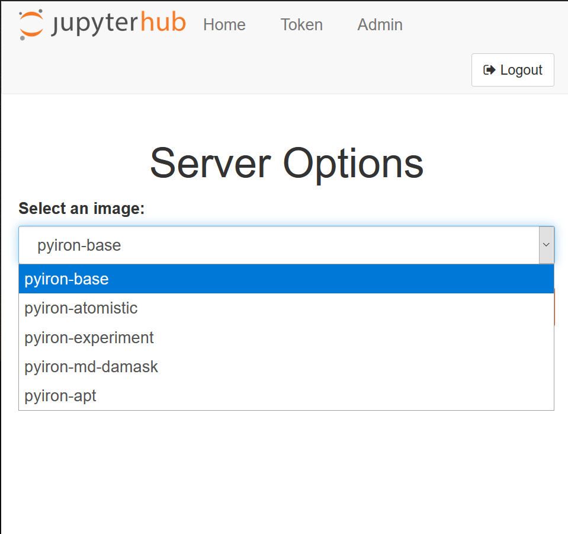

# MPIE-jupyterhub-server
Here, you can find the documentation on how to access and benefit from the jupyterhub server at MPIE.  
Please keep in mind that the server can be only accessed from MPIE local network or via VPN from outside.  
## The purpose of jupyterhub server  
 
This server has the aim to give MPIE members access to jupyter notebooks from their browser to benefit from open source python/conda packages developed in MPIE.  
 **<a href="https://jupyter.org/" target="_top">Jupyter notebook/lab</a>** is user-friendly environment to perform data analysis, visualization, simulation, etc **in your browser**. You can basically access a coding environment, command prompt, and visualization tool in the same environment. Via our server you will be able to analyze your experimental/simulation data in jupyter notebooks without the need to set up the environment, dependencies, etc. 
 
## Registration on the server  
To register on the server, please email the admin. Then the instruction including a one-time password will be sent to you via email.  
 
## Changing the one-time password
After receiving the one-time password via email, please first connect to the server via ssh. Upon your connection, after logging in, you will be asked to set a new password. **Please note that with the one-time password, you can not log in to the jupyterhub.**   
To connect the server, via ssh, you can use linux or mac terminal and enter `ssh <your_username>@cmserver02.mpie.de`. Please make sure of your vpn connection beforehand, if you are outside of the institute.  
From Windows OS, you need to use Windows PowerShell or windows subsystem for linux (WSL). 
 
## Login to jupyter server  
To access the jupyter server, one can browse to the link: <a href="http://cmserver02.mpie.de" target="_top"> https://cmserver02.mpie.de </a>.   
By entering your username and password, you will log in to the server:  
  
After you are logged in, you will be asked for your desired jupyter image.  
  
At the moment, there are five images available: pyiron-base, pyiron-atomistic, pyiron-experiment, pyiron-md-damask, and pyiron-apt. On all five images, pyiron is installed as the workflow management tool.   
Pyiron-base image, includes [pyiron_base](https://anaconda.org/conda-forge/pyiron_base). It is suitable for basic analysis, ML techniques, etc.   
Pyiron-atomistic image includes pyiron package which manages atomistic simulations via LAMMPS, SPHiNX, and GPAW.  
The pyiron-experimental image includes pyrion_base, TEMMETA, pyprismatic, hyperspy, and match-serie packages. It is mostly suitable to post-process data from TEM and STEM images.  
Pyiron-md-damask, in addition to the packages on the pyiron-atomistic, includes DAMASK. This image is very suitable for combination of pyiron atomistic simulations and DAMASK simulations.  
 
 
 
## Users' resources    
Via the provided username and password, users can log in to a jupyter notebook server and perform their data processing/simulation on the server. The computational resources assigned for each user are 3 computational nodes and 10 GB of RAM.  
 
 
## Users' access to the server via ssh  
Beside the access to the jupyter notebook via browser, users can connect to the server via their credential via the following command:    
`ssh <username>@cmserver02.mpie.de`  
 
The jupyter environment which you access via your browser, is linked to `~/pyiron_docker_workspace/`. So you can use this directory to add or remove files and see the changes in your jupyter environment via the browser.
 
## Data transfer   
To transfer the data to the server and the jupyter notebook environment, there are multiple ways:  
1) Using temp4All exchange server which is linked to the shared folder in your jupyter environment. The shared folder can be used additionally for collaboration with other users.  
2) Transferring files via jupyter lab interface.   
  
To access the jupyterlab interface, instead of jupyter notebooks, you should replace the word `tree` with `lab` in your browser address bar.     
 
3) Transferring files from a cloud to the notebooks, via wget command. Given the `url` and the `path` to save the files, one can use the following command within jupyter notebook.   
`import wget`    
`wget.download(url, out=path)`      
4) One can also transfer the files via `scp` command via linux/mac terminal or WSL on Windows machines. However, one should note that the jupyter notebook environment on this server is designed to access a specific path of user's home directory, which is `~/pyiron_docker_workspace/`. Therefore, if you would like to access the data from your jupyter notebooks, you should place the data under this path.
