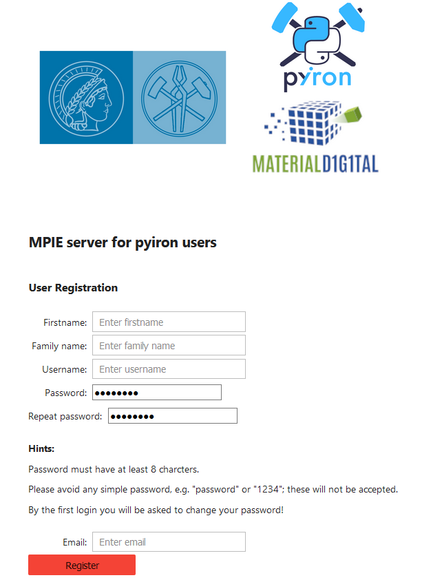
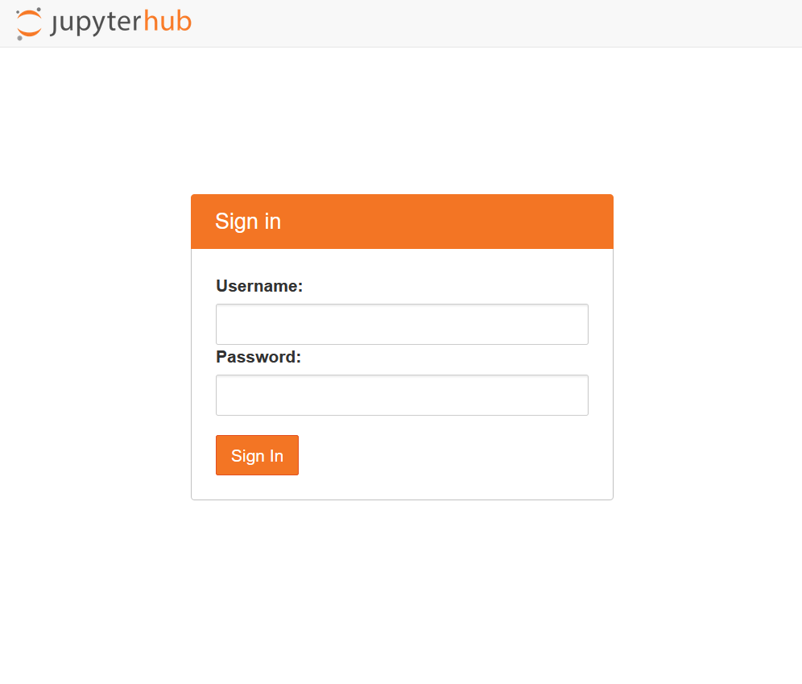
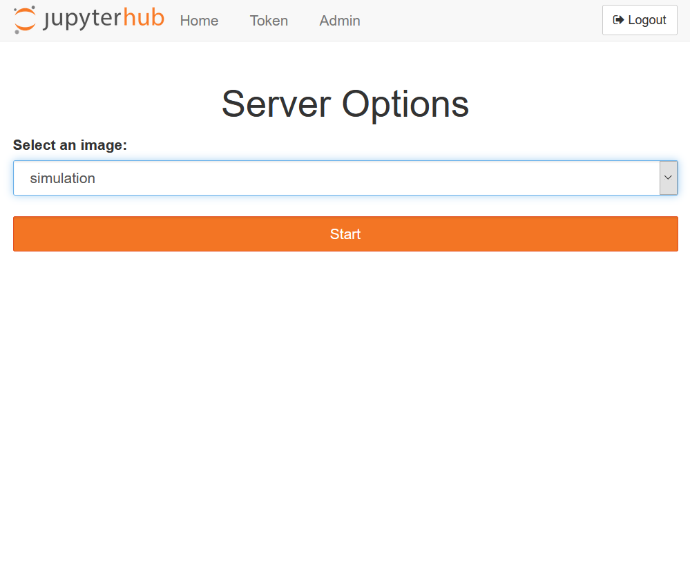
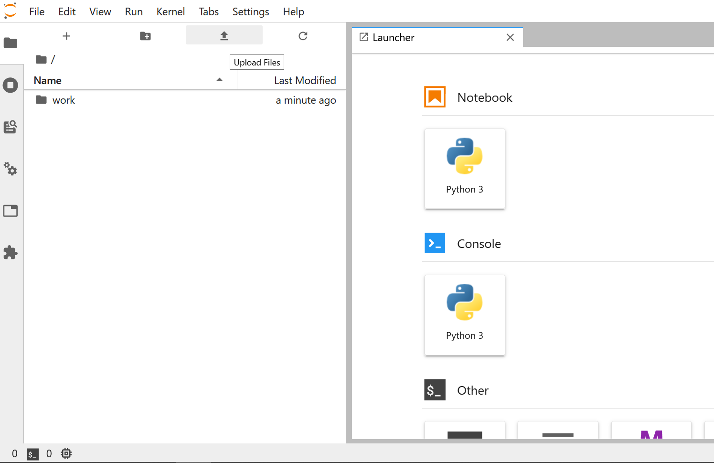

# pyiron-workflow-documentation
Here, you can find the documentation on how to access and benefit from the pyiron-workflow server in MPIE.  
Please keep in mind that the server can be only accessed from MPIE local network.  
## The purpose of pyiron-workflow server  

This server has the aim to give MPIE members access to jupyter notebooks from their browser to benefit from open source python/conda packages developed in MPIE.  
 **<a href="https://jupyter.org/" target="_top">Jupyter notebooks/lab</a>** are user-friendly tools to perform data analysis, visualization, simulation, etc **in your browser**. You can basically access a coding environment/command prompt. Via our server you will be able to analyze your experimental/simulation data in jupyter notebooks without the need to set up the environment, dependencies, etc. 
 
## Registration on the server  
To register on the server, you can visit <a href="http://cmserver02.mpie.de:8866" target="_top">here</a> from the local network in MPIE. 
After registration, you will receive an email confirming your registration with the require information.  

## Login to jupyter server  
To access the jupyter server, one can browse to the link: <a href="http://cmserver02.mpie.de" target="_top"> https://cmserver02.mpie.de </a>.   
By entering your username and password, you will log in to the server:  
  
After your login, you will be asked for your desired jupyter image.  
  
At the moment, there are two images available: experimental image, Pyiron image.   
The experimental image includes pyrion, TEMMETA, pyprismatic, and match-serie packages, while the pyiron image includes the atomistic packages.

## Users' resources    
Via the provided username and password, users can log in to a jupyter notebook server and perform their data processing/simulation on the server. The computational resources assigned for each user are 3 computational nodes and 10 GB of RAM.  

## Users' access to the server via ssh  
Beside the access to the jupyter notebook via browser, users can connect to the server via their credential via the following command:    
`ssh <username>@cmserver02.mpie.de`  

## Data transfer   
To transfer the data to the server and the jupyter notebook environment, there are multiple ways, from which three are mentioned here.  
1) Transferring  files via jupyter lab interface.   
  
To access the jupyterlab interface, instead of jupyter notebooks, you should replace the word tree with lab in your browser address bar.     

2) Transferring files from a cloud to the notebooks, via wget command. Given the `url` and the `path` to save the files, one can use the following command within jupyter notebook.   
`import wget`    
`wget.download(url, out=path)`      
3) One can also transfer the files via `scp` command. However, one should note that the jupyter notebook environment on this server is designed to access a specific path of user's home directory, which is `~/pyiron_workspace/`. Therefore, if you would like to access the data from your jupyter notebooks, you should place the data under this path.
